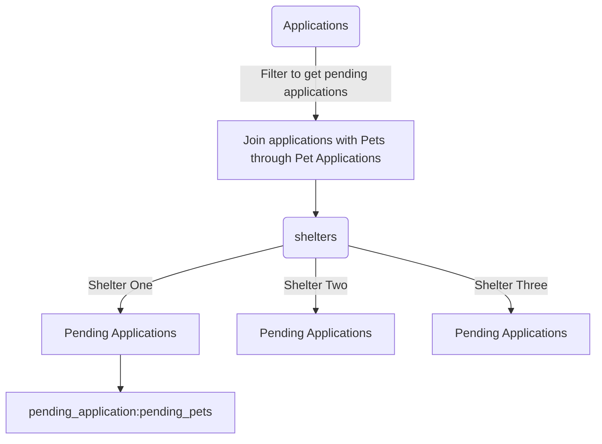

# Adopt, Don't Shop

## Background and Design

"Adopt Don't Shop" is a fictitious pet adoption application that allows users to apply for new pooches and for shelters to approve or deny applications on the server side. 26 User stories/learning goals were provided to guide the App's development. On top of this, I implemented active record callbacks and basic bootstrap front end design as independent challenges for myself.

## Database Design
[](https://postimg.cc/KkLrpwrZ)

#### Main goals for this project:
* Build out CRUD functionality for a many to many relationship
* Use ActiveRecord to write queries that join multiple tables of data together
* Use MVC to organize code effectively, limiting the amount of logic included in views and controllers
* Validate models and handle sad paths for invalid data input
* Use flash messages to give feedback to the user
* Use partials in views
* Use `within` blocks in tests
* [Track user stories using GitHub Projects](https://github.com/mbrandt00/adopt_dont_shop/projects/1)
* Deploy an application to Heroku

## Tools

Adopt, Don't Shop was built with Rails 5.2.6, in addition to PostgreSQL, HTML, CSS, and Ruby. [The app is currently deployed through Heroku](https://adoptdontshopbrandt.herokuapp.com), which was managed using the Heroku CLI. RSpec (with Capybara and Shoulda-Matchers gems) was used for test-driven development (TDD). SimpleCov was used to track test coverage, and reported 100% coverage. Feature tests were used to drive the development and test the functionality of all controllers and views, as well as unit tests for all models and model-level methods. Seed data was generated with the help of the Faker package.

## Local Deployment

Follow these instructions in your command line terminal:

1. Clone this repo:
    ```
    git clone git@github.com:mbrandt00/adopt_dont_shop.git
    ```
1. Install required gems:
    ```
    bundle install
    ```
1. Start the database:
    ```
    rails db:{create,migrate,seed}
    ```
1. To run test suite and view test coverage:
    ```
    rspec
    open coverage/index.html
    ```
1. Start the Rails server:
    ```
    rails s
    ```
1. In your browser, navigate to [localhost:3000](localhost:3000).


### Skills Developed by Project

#### Rails
* Describe use cases for a model that inherits from ApplicationRecord vs. a PORO
* Use MVC to organize code effectively, limiting the amount of logic included in views and controllers
* Make use of flash messages
* Use Inheritance from ApplicationController or a student created controller to store methods that will be used in multiple controllers
* Use Partials for views to DRY up code
* Use POROs to logically organize code for objects not stored in the database

#### ActiveRecord and Databases
* Use built-in ActiveRecord methods to create queries that calculate, select, filter, join, average, and order data from/through many tables
  - Here is an example of the querying needed to get pending applications for a shelter.

* Describe database relationships and terms such as "Many to Many" and "Join Table"

#### Testing and Debugging
* Write feature tests utilizing Capybara
* Sad Path Testing
* Write model tests with RSpec including validations, and class and instance methods

#### Web Applications
* Describe and implement ReSTful routing
* Identify use cases for, and implement non-ReSTful routes
* Identify the different components of URLs(protocol, domain, path, query params)
